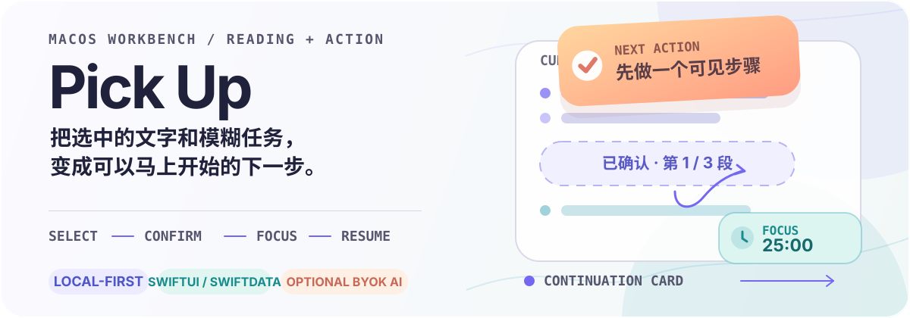

<p align="center">
  
</p>

<p align="center">
  一个面向 macOS 的阅读与行动工作台：从你主动选中的文字开始，整理上下文、拆出下一步、进入专注，并在下次回来时继续。
</p>

<p align="center">
  <code>macOS 14+</code>&nbsp;&nbsp; <code>SwiftUI</code>&nbsp;&nbsp; <code>SwiftData</code>&nbsp;&nbsp; <code>BYOK AI（可选）</code>
</p>

## Pick Up 是什么

Pick Up 面向“知道要做什么，但启动很困难”的阅读和工作场景。它把原本分散在其他 App、剪贴板、待办清单和计时器里的几个动作收进同一个工作台：

1. 在任意 App 中主动选择文字，或从剪贴板新建阅读内容。
2. 先预览并确认，再分段保存到本机。
3. 逐段阅读、朗读、标记重点，或针对当前范围请求 AI 阅读辅助。
4. 把模糊任务拆成带预计时间、所需材料和完成标准的步骤。
5. 开始一轮专注；结束时保存“已经完成 / 当前卡点 / 下次先做什么”。

下一次打开 Pick Up，可以从阅读位置、任务步骤或“继续卡片”恢复上下文，而不是重新回忆自己做到哪里。

## 核心能力

| 工作台 | 能做什么 |
| --- | --- |
| 阅读 | 通过辅助功能直接读取当前选区；不授权时可使用手动剪贴板入口；自动复制备用流程会在安全条件下恢复原剪贴板。 |
| 分段阅读 | 识别标题、段落和句子边界；支持逐段、连续和重点模式；阅读进度与重点保存在本机。 |
| 朗读 | 支持 macOS 本地语音，以及需单独确认的 Microsoft Edge 在线语音；可暂停、继续、调速和切换音色。 |
| 任务 | 本地规则拆解或可选的 AI 拆解；每一步都有动作、预计分钟数、材料和可核对的完成标准。 |
| 专注 | 以当前步骤为中心启动计时，可暂停、恢复、延长、提前结束并复盘结果；结束时可生成继续卡片。 |
| 继续与历史 | 搜索本地保存的文本、任务、专注记录和继续卡片，并导出 Markdown、纯文本或 JSON。 |

## 屏幕截图


## 快速开始

仓库当前提供 Xcode 项目源代码，尚未包含预构建安装包。

### 环境要求

- macOS 14 或更高版本
- Xcode（项目文件当前使用 Swift 5，并将 macOS Deployment Target 设为 14.0）
- 首次构建需要从 Swift Package Manager 获取 `KeyboardShortcuts` 3.0.1

### 在 Xcode 中运行

1. 打开 `Pick Up.xcodeproj`。
2. 选择 `Pick Up` scheme 和本机 macOS 目标。
3. 运行项目。
4. 首次启动按引导录制“读取当前选区”的全局快捷键。直接取词需要在系统设置中授予辅助功能权限；也可以跳过授权，使用“从剪贴板新建”。

首次成功路径可以是：在 TextEdit、Safari 或其他文字 App 中选择一段文字 → 按你录制的快捷键 → 检查来源和文本预览 → 点击“分段阅读”。

### 使用命令行运行测试

```bash
xcodebuild \
  -project "Pick Up.xcodeproj" \
  -scheme "Pick Up" \
  -destination 'platform=macOS' \
  test
```

测试覆盖 Swift Testing 单元测试、SwiftData 本地仓库、文本分段、剪贴板保护、AI 结构化响应、在线语音分块，以及 XCTest UI 流程。

## 常用快捷键

下列是应用菜单提供的固定快捷键；全局“读取当前选区”快捷键可以在首次启动或设置中另行录制：

| 快捷键 | 动作 |
| --- | --- |
| `⇧⌘R` | 读取当前选区 |
| `⇧⌘V` | 从剪贴板新建 |
| `⌘N` | 新建任务 |
| `⌘1` / `⌘2` / `⌘3` | 切换阅读 / 任务 / 继续与历史 |
| `⌘,` | 打开设置 |
| `⌥⌘F` | 保持工作台在其他窗口上方 |

## 可选：配置 BYOK AI

AI 默认关闭。启用后，Pick Up 使用 OpenAI-compatible `chat/completions` 接口，并在每次发送前展示服务地址、模型和将要发送的准确文本。

在“设置 → BYOK AI（可选）”中填写：

- `API Base URL`，例如 `https://api.openai.com/v1`；远程服务必须使用 HTTPS，本机回环地址允许 HTTP。
- 服务提供的模型名称。
- API Key。Key 只写入 macOS 钥匙串，不会写入阅读文档或任务记录。

AI 可以用于两类工作：

- 阅读辅助：简化句子、解释术语、生成问题；范围可以是选中文字、当前段落或全文。
- 任务拆解：在需要时先问一个澄清问题，再生成 3–5 个可编辑步骤。

AI 返回内容必须通过本地结构化校验；失败时不会替换原文，也不会覆盖已有任务。阅读辅助最多发送 20,000 个字符，任务描述最多发送 2,000 个字符。

## 隐私与数据流

- 只有在你主动按下快捷键或选择菜单操作时，Pick Up 才会尝试读取文字；不会持续录屏或持续监听键盘。
- 阅读内容、任务、专注会话、重点和继续卡片通过 SwiftData 保存在本机。
- 直接读取其他 App 的选区需要辅助功能权限；不授予时仍可手动复制后使用剪贴板入口。
- 自动复制备用流程会记录并尝试恢复原剪贴板的多个 item 和类型；如果你在期间再次修改剪贴板，Pick Up 不会覆盖你的新内容。
- macOS 本地语音不会上传文字。
- Microsoft Edge 在线语音在首次使用前需要明确同意；待朗读文字会发送到非官方在线语音接口，该接口可能随时变化。
- AI 只有在你主动启用、确认发送预览并配置服务后才会请求网络。

## 当前边界

项目仍在开发中，以下内容不要视为已经完成的发布承诺：

- `Docs/Phase1-Compatibility-Matrix.md` 中列出的 TextEdit、Safari、Preview 和 Microsoft Word 跨 App 矩阵仍待 macOS 14 实机逐项验证。
- Phase 1 不包含扫描 PDF、图片文字或 OCR。
- 在线语音依赖非官方 Edge 接口，网络、服务端响应和接口变化都可能导致失败；设置中可以切换到 macOS 本地语音。
- 仓库当前没有发布包或自动发布流程。若要分发或二次使用，请先补充相应的签名、公证和发布说明。

## 代码结构

```text
Pick Up/
├── AppViewModel.swift          # 捕获、阅读和工作台状态编排
├── CaptureServices.swift       # 辅助功能取词与剪贴板保护
├── TextSegmenter.swift          # 标题、段落和句子分段
├── ReaderView.swift             # 阅读、重点和 AI 阅读辅助
├── SpeechController.swift       # macOS / Edge 朗读队列与高亮
├── TaskBreakdown.swift          # 本地任务拆解规则
├── TaskWorkspaceViewModel.swift # 任务、专注计时和复盘
├── AIWorkflows.swift            # 任务与阅读的结构化 AI 工作流
├── OpenAICompatibleClient.swift # OpenAI-compatible HTTP 客户端
├── Phase3ViewModel.swift        # 继续卡片与本地历史
└── *Repository.swift            # SwiftData 持久化边界
```

`Pick UpTests/` 包含领域逻辑和持久化测试，`Pick UpUITests/` 覆盖首次启动、阅读、紧凑窗口、任务专注、历史恢复和 API Key 设置等关键路径。`Docs/` 保存兼容性验收清单。

## 许可证

项目使用 Apache License 2.0，详见 [`LICENSE`](./LICENSE)。正式分发前，请继续补充必要的第三方依赖声明和发布说明。
